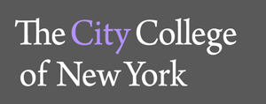

# Sponsors 

American Physical Society  
American Astronomical Society  
Barnard College  
Brookhaven National Lab  
City College of New York, Dean of Science  
City College of New York, Office of the President    
City College of New York, 21st Century Foundation  
Columbia College  
Columbia University, Department of Astronomy  
Columbia University, Department of Physics  
Columbia University, Office of Diversity and Multicultural Affairs  
Columbia University, Faculty of Arts & Sciences  
Columbia University, Graduate School of Arts and Sciences  
Columbia School of Engineering and Applied Science  
City University of New York, Graduate Center  
D.E. Shaw  
Department of Energy  
Flatiron Institute

        

      

   

